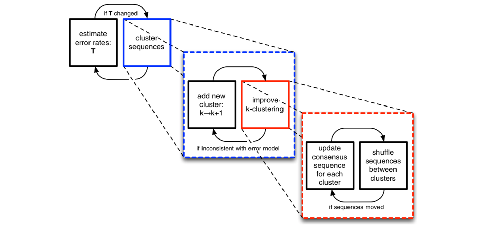

```{r setup, include=FALSE}
knitr::opts_chunk$set(echo=TRUE, 
                      message=FALSE, 
                      warning=FALSE, 
                      paged.print=FALSE, 
                      fig.align = "center")

startTime <- Sys.time() # start to count the running time

```

<br>

## 16S rRNA gene amplicon - upstream data analysis

<br>


Trainer: António Sousa ([Bioinformatics Unit - IGC](http://www.igc.gulbenkian.pt/)) 

Contact: agsousa@igc.gulbenkian.pt 

Day: 31 January 2020

Place: [IGC](http://www.igc.gulbenkian.pt/), Oeiras, Portugal

<br>

### Introduction

The next-generation sequencing (NGS) of 16S rRNA gene amplicon generates large amounts of raw sequence data that needs to be processed before being annotated against a reference database. Processing reads into comprehensive biological information consists in decreasing the complexity from these huge sequence datasets until annotation tables using high-performance algorithms integrated in bioinformatics pipelines [@leipzig2017review]. Basically what we try to do when we are analysing 16S rRNA gene amplicon NGS data is to reverse the whole proccess: from sequencing --> library prep --> DNA extraction --> original community --> to single bacteria. For the analysis of 16S rRNA gene amplicon NGS data it usually includes the following steps (not necessarily all neither by this order): 

  (1) demultiplexing the raw amplicon libraries into samples based on barcodes/indexes sequences
  (2) filter/trim primers and the reads based on quality (Phred) scores, length, homopolymers, *etc* 
  (3) join/merge paired-end reads (only for paired-end reads - Illumina) 
  (4) align reads for further quality control (optional)
  (5) dereplicating equal/unique sequences (100% identical sequences) 
  (6) detect/remove chimeras - artificial sequences with multi parent origin produced during PCR amplification (optional)
  (7) cluster unique/dereplicated sequences into Operational Taxonomic Units (OTUs) based on user-defined threshold (usually 97-98%) 
  (8) classify/annotate taxonomically OTUs against a non-redundant reference database

Following this pipeline you will end-up with the so called **OTU** table (with annotation) often clustered at 97% similarity threshold. An **OTU** is a bioinformatic term for *Operational Taxonomic Unit* that represents one cluster of similar sequences (>97%) of one *species* or taxa. Sequences are clustered into OTUs mostly by two reasons: 

  + to mask some intraspecific diversity
  + to mask sequencing errors 

However, to get an approximation of roughly 1 OTU ≈ 1 species, the threshold of 97% proved to be slightly higher - close to 100% for the V4 region of the 16S rRNA gene ([Edgar, 2018](https://duckduckgo.com/?q=Updating+the+97%25+identity+threshold+for+16S+ribosomal+RNA+OTUs&t=osx&ia=web)). Therefore, if we could eliminate sequencing errors, we would not need to cluster sequences into OTUs. 

<br>

<center><figure>
  
  <figcaption>Figure describing the difference between *Amplicon Sequence Variants* (**ASVs**) *vs* *Operational Taxonomic Units* (**OTUs**) (figure adapted from [@callahan2016dada2]).</figcaption>
</figure></center>

<br>

Denoising is the step of removing sequencing noise, *i.e.*, removing sequencing errors from sequencing reads. There are several *denoising* algorithms. This course will focus on the **Divisive Amplicon Denoising Algorithm** (aka **DADA2**) an algorithm for correcting Illumina-sequenced amplicon errors [@rosen2012denoising;@callahan2016dada2]. **DADA2** removes the sequencing error from reads yielding true biological sequences. Thus it does not cluster sequences into OTUs to mask sequencing errors. These *unique partitions of sequences* are different from OTUs since they vary between them as little as 1 nucleotide. Therefore these *unique partitions of sequences* were designated **Amplicon Sequence Variants** (aka exact sequences or sub-OTUs). We choose **DADA2** for several reasons, one of these was because it allows flexibility to proccess several types of data, such as 454, Ion Torrent and single- as well as paired-end Illumina amplicon NGS data, with different amplicon sizes, *e.g.*, ITS, 18S and 16S rRNA genes, full-length 16S rRNA genes (from PacBio), in all operating systems (ubuntu, Mac OS and Windows). The two main advantages of applying denoising-based instead of OTU-based approaches and of working with ASVs *vs* OTUs are: 

  + they diverge as little as 1 nucleotide and, therefore, they represent single nucleotide variants, *i.e.*, there was an increase in genetic resolution compared with OTU-clustering based approaches 
  + it allows consistent labelling since denoised unique sequences are true biological sequences without sequencing errors, this means that there is no need to cluster sequences into OTUs in order to mask sequencing errors ([Callahan et al., 2017](https://www.nature.com/articles/ismej2017119.pdf))  

**DADA2** is a *denoising* algorithm but also a pipeline *per se* implemented in the [*R programing language*](https://benjjneb.github.io/dada2/index.html) that is able to perform the following bioinformatic steps:

   (0) fastq control
   (1) filter and trim reads  
   (2) estimate error rates
   (3) dereplicate reads into unique sequences
   (4) denoise unique sequences (and exclude singletons)
   (5) merge denoised forward and reverse reads 
   (6) construct an ASV table 
   (7) remove chimeras
   (8) assign taxonomy
   (9) evaluate accuracy and contamination (with a *mock community*)

Despite these differences between *denoising-* *vs* *clustering-*pipelines, the diversity patterns of a specific 16S rRNA gene amplicon NGS study should be similar no matter the kind of pipeline applied [@glassman2018broadscale].

<br>


### Before getting started 

This tutorial is a replication of the [**original DADA2 tutorial**](https://benjjneb.github.io/dada2/tutorial.html) using the same subset of 16S rRNA gene amplicon data from fecal mouse samples published by the [Schloss lab](https://www.ncbi.nlm.nih.gov/pmc/articles/PMC3753973/pdf/zam5112.pdf) [@kozich2013development]. This dataset was chosen because it was also used in the [mothur MiSeq SOP](https://www.mothur.org/wiki/MiSeq_SOP) that runs an OTU-clustering based pipeline, and, thus it allows us to compare our results (although we do not have the time to do it during this short introduction course, but you can do it). This subset includes fecal mouse samples collected daily from the next 150 days post-weaning (early - 0-9 days - and late - 141-150 days). So, one of the questions that you can try to answer is: **How the stability of the mouse gut microbiome changed with the rapid change in mouse weight observed during early days to the late days after weaning?** 


<br>

#### How to read this notebook?

>Text: tips and important messages appear indented like this.

<details><summary>**Text** (click!)</summary><p>
If **text** appear in bold is a note with auxiliary information that may be useful. Usually it contains bioinformatic terms, exaplanations and information about R code and syntax. 
</p></details>

<br>

<details><summary>*Text* (click!)</summary><p>
*Answers* to *questions* appeared in italic. 
</p></details>

<br>

#### Requirements: 

   + [Download the 16S rRNA gene amplicon data](http://www.mothur.org/w/images/d/d6/MiSeqSOPData.zip) (this was already downloaded for you for convenience)
   
   + Download the Silva reference database: 
      
      + [silva_nr_v132_train_set.fa.gz](https://zenodo.org/record/1172783/files/silva_nr_v132_train_set.fa.gz?download=1): to assign taxonomy until genus based on naive Bayes classifier (this was already downloaded for you for convenience)
      + [silva_species_assignment_v132.fa.gz](https://zenodo.org/record/1172783/files/silva_species_assignment_v132.fa.gz?download=1): to assign taxonomy until species level based on 100% match (this was already downloaded for you for convenience)
      
   
   + [R version 3.6.2](https://www.r-project.org) and [Rstudio](https://rstudio.com) 
   
   + [dada2 v.1.14.0](https://benjjneb.github.io/dada2/index.html) R package and dependencies
   
   + [biom v.2.1.7](http://biom-format.org) command-line python program
   
   + [**Biome-Shiny**: *A Shiny R app for microbiome visualization*](https://github.com/BioData-PT/Biome-Shiny) R shiny app 

<br>

><p><font>The *16S rRNA gene amplicon - upstream data analysis* from **Biome-shiny Biodata.pt Crash Course** requires the participants to be familiar with the **R programming language and environment**.</p><font> 

<details><summary>**R markdown**</summary><p>
This document that you open in **Rstudio** is a *R markdown* document (with the file extension *.Rmd*). A [*markdown*](https://rmarkdown.rstudio.com) document is a plain text file with some special syntax that can be easily compiled into a *html* file. The *R markdown* is a *markdown* document with *R language* embedded. Therefore, *R markdown* is a very useful resource to write reports since you can combine the text, R programming language and output, *e.g.*, tables, plots and *e.t.c.*, into one single document. 
</p></details>
  
<br>


<br>


### Let's start 

#### Import *dada2* packages (and dependencies)

First we will run the **R chunk** code below to import/load *dada2*, its dependencies packages. When you import a package, you are importing/loading all the functions, and perhaps data, if it contains, to your current R session (and memory).

<details><summary>**R chunk code**</summary><p> 

It is the special gray text box that allow you to write and run *R code* inside the **R markdown** document. This particular chunk will *install and import packages* required to follow the *upstream data analysis* of 16S rRNA gene amplicon data. 
The default **R chunk** code opened in *Rstudio* has color-symbolic text:

   + <span style="color:green">green</span>: text, aka *strings* in programming (although there is two types of code - (1) *comments* that start with **'#'** and (2) *strings* that incorporate the R code always between quotation marks like this **"string"** )
   
   + <span style="color:blue">blue</span>: special *functions()*, like *library()* to import packages/libraries, logical (`TRUE`/`FALSE`) and numbers
   
   + <span style="color:black">**black**</span>: most of the *functions()*, signs, like **+**, **x**, and parameters (function options that the user uses when calls a function, like below, we passed the *argument* **"dada2"** to the *parameter* **package**)
   
   </p></details>

<br>

```{r install and import packages, message=FALSE, warning=FALSE, paged.print=FALSE}

### Install and import packages 

## dada2 from CRAN (currently does not work for R version 3.6.2)
#install.packages(pkgs = "dada2") # this function will try to install the latest version of 'dada2' from CRAN - remove the '#' if you don't have 'dada2' installed
## dada2 instalation from github repository
#install.packages("devtools") #install this package first to install 'dada2' then; if you run into problems during the installation, you may need to run the following command in your terminal (assuming that you are using an Ubuntu OS); for other OS you may need to use other commands
#sudo apt install libfontconfig1-dev libcairo2-dev libcurl4-openssl-dev libssl-dev libxml2-dev 
#
#
#devtools::install_github("benjjneb/dada2", ref="v1.14") # this will install the 'dada2' version '1.14' from the 'benjjneb' github repo
library(package = "dada2") # import package 'dada2'
packageVersion(pkg = "dada2") # prints the 'dada2' version that you have imported - see below after running this function

```

<br>


<details><summary>**Set seed**</summary><p> 

Often you will use functions to perform tasks that requires *randomness*, such as *bootstrapping* in statistics (*i.e.*, random sampling with replacement). Well, we usually re-analyse countless times the same data. Therefore, this will cause slight changes in the output, let's say a number from some calculation,  even if you run exactly the same script. To avoid this we will do what is known as **set seed**. This is, we will keep the *seed* the same no matter how many times we need to run the script. How this  guarantees the reproducibility? Computers can not generate *true* random numbers. They rely on the [**seed**](https://en.wikipedia.org/wiki/Random_seed) to generate a *pseudorandom number*. If you know the *seed*, *i.e.*, if you set the seed, you can predict which will be the *pseudorandom number* generated by the computer.

</p></details>

Run the R chunk code below to set the **seed** to '1024'. 

```{r set seed, message=FALSE, warning=FALSE, paged.print=FALSE}

### Set seed
set.seed(1024) # set seed to the number '1024' - you can use any number

```

<br>


#### Define the directory of 16S rRNA gene amplicon fastq files

<details><summary>**R's assignment operator**</summary><p>

Below you can find for the first time in this document the sign **'<-'** that is known as *assignment operator* (equal to **'='**) and as the name suggests it assigns *something* to other *thing*. In the first line of code below it assigns the string *"./MiSeq_SOP"* to the variable *fastqPath*. Therefore the variable or as it is known in R *the object* **fastqPath** contains the string *"./MiSeq_SOP"*.

</p></details>  

<br>

Run the R chunk code below to assign

```{r set path to NGS files, message=FALSE, warning=FALSE, paged.print=FALSE}

### set the relative path to the 16S rRNA gene amplicon fastq files directory

fastqPath <- "./MiSeq_SOP" # set the path to the 16S rRNA gene amplicon fastq files that you have download 'MiSeq_SOP' (the './' is a notation used that means 'in the current directory')
list.files(fastqPath) # list all the files under the directory 'fastqPath == ./MiSeq_SOP'

```

<br>

As you can see we have 6 types of data inside the directory/folder *'./MiSeq_SOP'*: 

   + **fastq**: text plain files with fasta DNA sequences and associated Phred quality scores. Each sequence contains 4 lines: 1<sup>st</sup> fastq header that starts with a **'@'** character; 2<sup>nd</sup> fasta DNA sequence; 3<sup>rd</sup> **'+'** sign; and 4<sup>th</sup> quality scores associated with each nucleotide in the fasta sequence. These files are the ones that we are interested in and that will be used throughout this pipeline. The fastq files, with the exception of the files with the preffix **Mock**, are from mouse fecal samples. The first **F3** means *F*emale number *3* and the **D** followed by one **number** means *D*ay and the *number* of post-weaning. Since we have paired-end 16S rRNA gene amplicon Illumina MiSeq data (250 bp-long reads spanning the V4 region), the tag **R1** denotes *forward* fastq files and the tag **R2** denotes *reverse* fastq files.  
   
   + **HMP_MOCK.v35.fasta**: text plain file with 32 fasta DNA sequences (with some redundant sequences) containing 21 representative strains sequences used in the **mock community** (check the 21 strains that appear in the mock community - Materials and Methods section, Community DNA subsection from [Kozich et al., (2013)](https://www.ncbi.nlm.nih.gov/pmc/articles/PMC3753973/pdf/zam5112.pdf)) - although only 20 strains were identified in the corresponding fastq sequencing files (*Mock_S280_L001_R1_001.fastq* and *Mock_S280_L001_R2_001.fastq*). This will be used latter to evaluate the accuracy and possible contamination in this study.
   
   + **mouse.time.design**: text plain file with the experimental design of this study. It cointains two columns: (1) **group** column with the samples names (the same name as you will see below) and (2) **time** categorical/factor column assuming two possible levels **Early** (from day 0 to 9) or **Late** (from day 141 to 150) - depending on the post-weaning day.
   
  + *mouse.dpw.metadata*, *stability.files* and *stability.batch*: text plain files with metadata and commands needed to run the [mothur MiSeq SOP](https://www.mothur.org/wiki/MiSeq_SOP). We will not use these!


Run the R chunk code below to create a path specifying a directory for each forward fastq file with the pattern - `_R1_001.fastq` - and reverse fastq files with the pattern - `_R2_001.fastq`. Notice that after we had specified the relative path for all the forward and reverse fastq files we used the function `sort()`. This is really important, because it will order forward and reverse fastq files in the same way if they have exactly the same preffix name (of course with the exception of the *_R1_* and *_R2_* tags). All dowstream steps assume that forward and reverse fastq files are ordered. What this means? It means that the 1<sup>st</sup> element of the vector `fastqFwdPath` corresponds to the same sample in the 1<sup>st</sup> element of the vector `fastqRevPath` and so on. 

Then, retrieve the `sampleNames` from one of the paths that we specified before (because the sample names is the same for forward and reverse files just change the suffix name `_R1_001.fastq`/`_R2_001.fastq` between forward/reverse). 

<details><summary>**Nested functions in R**</summary><p>

Below you can find for the first time in this document the application of a **nested function** in R. If you note the function `list.files()` is given as input to the argument `x` of the function `sort()`. This is known as `nested functions` - call functions inside functions (there is no limit about how many functions we can call inside other functions, since the output of a function can be used as input of the outmost function). 

</p></details> 

<br>

<details><summary>**vectors in R**</summary><p>

An R *vector* is 1-D data structure comprising elements of the same class, *e.g.*, `numeric` or `character`, built with the `c()` function that stands for `combine` - `a <- c(1, 2, 3, 45, 56)` assigning a `vector` of class `numeric` to the variable name `a` that contains the values `1, 2, 3, 45, 56`. 

</p></details> 

<br>

```{r set path to fwd and rev fastq}

# create a path to each forward and reverse fastq file 
fastqFwdPath <- sort(x = list.files(path = fastqPath, pattern = "_R1_001.fastq", full.names = TRUE)) # sort fwd fastq file paths
fastqRevPath <- sort(x = list.files(path = fastqPath, pattern = "_R2_001.fastq", full.names = TRUE)) # sort rev fastq file paths

# extract the sample names  
sampleNames <- sapply(X = strsplit(x = basename(path = fastqFwdPath), split = "_"), FUN = `[`, 1) # extract sample names from fastqFwdPath
sampleNames # print the sample names 

```

<br>

Are you sure that file paths of forward and reverse fastq files are sorted in the same way? 

Below you can use a built-in function to check if `fastqFwdPath` and `fastqRevPath` are or not sorted (sanity check!).

<br>

```{r check fwd and rev fastq file lists}

### Compare if fwd and rev fastq file lists correspond (if are sorted)

source("./scripts/biodataPtCrashCourse.R") # import R script with built-in functions

## compareSamplesNames(): built-in function to compare vector files lists of fwd and rev sample names
compareSampleNames(fwdPathList = fastqFwdPath, revPathList = fastqRevPath, splitSymbol = "_", pickElement = 1) # function that takes as input 4 arguments: (1-2) `fastqFwdPath` and `fastqRevPath` vector fwd and rev path lists; (3) the `splitSymbol` (in our case samples are separated by the symbol "_") and (4) `pickElement` `1`, it means after siplit names by "_" pick the first suffix (that contains the sample name)

```

<br>

*Question*: **How many samples make part of this study?**

><p><font size=2>Tip: try to give the *sampleNames* object to the function `length()`</p></font>

<details><summary>*Answer*</summary><p> 

There are `r length(sampleNames)` samples: 19 fecal mouse samples plus one mock community sample. 

</p></details>

<br>


### (0) Fastq Control 

One of the preliminary tasks in the analysis of 16S rRNA gene amplicon NGS data is the analysis of the quality scores (aka [Phred (Q) scores](https://drive5.com/usearch/manual/quality_score.html)) in both, forward and reverse, fastq files. It is based on the interpretation of these plots that you can make a supported decision latter about the parameters that you will choose to filter and trim the fastq files. Therefore, apply the `dada2` function `plotQualityProfile()` in order to get the quality profiles for forward and reverse files. Give as input/argument the vector list of forward and reverse fastq files: `fastqFwdPath` and `fastqRevPath`.

<br>

```{r fastQC, fig.height = 8, fig.width=13}

### Plot the quality profiles 

#dir.create("fastQC_plots") # create the folder "fastQC_plots" - remove the first '#' to create this folder if you want to save the plots as pdf files under this folder

#pdf(file = "fastQC_plots/fwd_fastqc_plots.pdf", width = 13, height = 8) # remove the first '#' to save the pdf file with the plot fastq profile under the folder "fastQC_plots"
plotQualityProfile(fl = fastqFwdPath) # plot the fastq profiles for the forward fastq files 
#dev.off() # clear the output

#pdf(file = "fastQC_plots/rev_fastqc_plots.pdf", width = 13, height = 8) # do the same as mentioned above but for the reverse fastq files
plotQualityProfile(fl = fastqRevPath) # plot the fastq profiles for the reverse fastq files 
#dev.off()

```

<br>

*Question*: **Which kind of information you can find in the plots that you made?**

<details><summary>*Answer*</summary><p>
The frequency, median and quartiles of Q score *per* base (gray area, green and orange lines), the average read-length and number of reads per each fastq (forward or reverse) sample. 
</p></details>

<br>

*Question*: **Based on the interpretation of these plots, would you say that forward and reverse fastq files are similar in terms of quality?**

<details><summary>*Answer*</summary><p>
No! This is because the sequencing-by-synthesis (the method used by Illumina technology) is based on enzymatic reactions that have less efficiency to incorporate nucleotides in the reverse direction *3'-->5'*. Of course that the enzyme kinetics also drops in efficiency at the begining of each read and at the end of each read, no matter the direction, but often this is much more pronounced in reverse reads. 
</p></details>

<br>


### (1) Filter and trim reads

Filter and trim fastq files based on quality parameters is an essential step in the analysis of 16S rRNA gene amplicon NGS data. It is really important to use very stringent parameters to try to filter and trim out any sequencing error. Latter we will perform the *denoising* step which tries to remove sequencing reads with errors, but the more errors you have it will discard more sequences. It is well known in NGS data analysis in general that removing errors improves the performance of dowstream data analysis. We will apply the `dada2` function `filterAndTrim()` to perform the trimming and filtering of both forward and reverse fastq files.   

<br>

<details><summary>**Bioinformatic jargon**</summary><p>
**Truncation**: it refers to the action of cutting the reads at some specific bp position in order to have all reads with the same length. If you truncate your reads at 200 bp, it means that you will not have reads less neither higher than 200 bp long.  

**Trimming**: it refers to the action of cutting the 5'- or/and 3'-ends from your reads. It includes trim out the adapters, barcodes and primers from your reads.  
</p></details>

<br>

*Question*: **Which are the parameters that we should choose to filter and trim the fastq files? What Q scores? What read-length?**

<details><summary>*Answer*</summary><p>
Q score - `truncQ`: here we will use a conservative quality score of 2 meaning that if a read has at some position a Q score ≤ 2 (this means that has a base-call accuracy of < 50%), truncate the read at that position. If the read-length after truncating this read is less than the truncation length (`truncLen` see below), discard the read. Set `truncQ = 2` for both, forward and reverse reads (if you put only one number it will assume the same for `forward` and `reverse` reads, otherwise put `truncQ = c(2,3)` if you want to set a different Q score for `forward` and `reverse` reads).

Read-length - `truncLen`: the Q scores start to drop close to the 250 bp end of forward reads and after the 150 bp for the reverse reads. Thus a good read-length would be the truncation of forward and reverse reads at 240 and 160 bp positions, respectively, *i.e*, `truncLen = c(240, 160)`. 

Other important parameters to have into consideration are the number of ambigous, aka **N**, bases (`maxN` parameter in the function `filterAndTrim` below) and *expected errors* (`maxEE`). Usually the no. of ambiguous bases allowed is zero because you do not want to keep reads with bases that you do not know what they are. Any read with ambiguous bases will be discarded - `maxN = 0`. The *maximum expected errors* for forward and reverse reads will be the same 2 - `maxEE = 2` because the sequencing error in Illumina is around 1%, so let's allow 2 mismatches along 200 bp length.   
</p></details>

<br>

In this case the 16S rRNA gene region sequenced was the **V4 region** that is around 253 bp long. This means that our forward and reverse 250 bp long reads fully overlap. When you are truncating paired-end sequencing data you should be aware that after **truncation** reads should overlap at least over a 20 bp long region (a minimum of 12 perfect matches between forward and reverse reads ends - without mismatches). Otherwise you will not be able to merge the forward and reverse reads latter on.

Since the bacterial phage DNA is widely used as a control in sequencing facilities, the parameter `rm.phix = TRUE` will search for reads that align against the phiX genome and discard them. The options `compress = TRUE` and `verbose = FALSE` are given to compress the filtered fastq files (that's why they have the file extension **'.gz'**) and to not print any warning/message while is running this function, respectively. The parameter `multithread` for the function `filterAndTrim` is to parallelize the jobs but does not work for Windows. So if you want to run this pipeline on Windows operating system just set this parameter to  `multithread = FALSE`. 

Run the next R chunk code to apply the *filtering and trimming* with the `dada2` function `filterAndTrim()`. The `filterAndTrim()` function performs the filtering and trimming as specified in the parameters and write the output, *i.e.*, the fastq filtered files, to the directories specified below `filtFastqFwdPath` (for forward fastq files) and `filtFastqRevPath` (for reverse fastq files) and also prints/gives the number of sequences that were kept after filtering/trimming in relation to the initial number of reads. 

```{r filter and trim reads, message=FALSE, warning=FALSE, paged.print=FALSE}

### Filter and trim reads

filtFastqFwdPath <- file.path(fastqPath, "filtered", paste0(sampleNames, "_fwd_filt.fastq.gz")) # relative file path for fwd filtered reads that will be created below 
filtFastqRevPath <- file.path(fastqPath, "filtered", paste0(sampleNames, "_rev_filt.fastq.gz")) # relative file path for rev filtered reads that will be created below

## assign to each file path the sample name
names(filtFastqFwdPath) <- sampleNames 
names(filtFastqRevPath) <- sampleNames

## filter and trim fwd and rev fastq files writing the new filtered files in compressed - '.gz' - format to the directories specified above
filterTrimReads <- filterAndTrim(fwd = fastqFwdPath, filt = filtFastqFwdPath, rev = fastqRevPath, filt.rev = filtFastqRevPath, truncLen = c(240,160), maxEE = 2, truncQ = 2, maxN = 0, rm.phix = TRUE, compress = TRUE, verbose = FALSE, multithread = TRUE) 

knitr::kable(filterTrimReads) # fancy way to print the matrix, you could just do 'filterTrimReads'

```

<br>

*Question*: **How many reads did you loose during the *filter and trim* step?**

><p><font size=2>Tip: `filterTrimReads` is a R object of `class(filterTrimReads)` = *matrix* (a matrix is a 2-D data structure of one type, *e.g.*, numeric or character type). To *index* (=select a column(s) or/and row(s)) you can call the matrix object `filterTrimReads[,]` followed by **[,]** with a comma **,** separating the rows and columns, respectively (**[rows, columns]**). If you leave the row and column fields empty, like this `filterTrimReads[,]` will print the whole matrix. If you want to print all columns for sample `F3D144_S210_L001_R1_001.fastq` do `filterTrimReads["F3D144_S210_L001_R1_001.fastq",]` (it will print all columns because the column field is empty). `filterTrimReads[,"reads.in"]` prints only the values for the `reads.in` column. I think that you got the idea! 
So, what we want is to subtract the values of `reads.out` to the values of `reads.in` column to get the difference and use these values (for each sample) to divide them by the initial values, *i.e.*, `reads.in` column values, in order to get the proportion/fraction of reads lost and finally multiply by `100` to get the percentage: (`reads.in` - `reads.out`) / `reads.in` x 100 (mathematical formula!) Can you do it in **R**? After determining the percentage of reads lost you can try to explore the functions `min()` and `max()` that gives you the miminum and maximum values among a vector of values.
</p></font>

<details><summary>*Answer*</summary><p>
So, the solution is: `filterTrimReadsDiscard <- (filterTrimReads[,"reads.in"] - filterTrimReads[,"reads.out"]) / filterTrimReads[,"reads.in"] * 100`. 

The percentage of reads lost during the *(1) Filter and trim reads* step was between`r filterTrimReadsDiscard <- (filterTrimReads[,"reads.in"] - filterTrimReads[,"reads.out"]) / filterTrimReads[,"reads.in"] * 100 # this is just R code embedded in markdown` `r min(filterTrimReadsDiscard)`-`r max(filterTrimReadsDiscard)`%. 
</p></details>

<br>

Let's look again to the quality of forward and reverse reads after we had applied the filtering/trimming. 

<br>

*Question*: **Plot the quality profile of your forward and reverse good-quality/filtered reads with the function `plotQualityProfile()`. Which object do you need to give to this function? Are the quality profiles better than before we had applyied the filtering/trimming?**

<details><summary>*Answer*</summary><p>
You need to pass the object that contains the path to the filtered forward or reverse fastq files to the function `plotQualityProfile()`: `filtFastqFwdPath` (object with a list of relative paths to the filtered forward fastq files) and `filtFastqRevPath` (object with a list of relative paths to the filtered reverse fastq files). 

```{r plotQualityProfiles - solution, fig.height = 8, fig.width=13}

# forward quality plots
plotQualityProfile(fl = filtFastqFwdPath) # list of paths to the forward filtered fastq files

# reverse quality plots
plotQualityProfile(fl = filtFastqRevPath) # list of paths to the reverse filtered fastq files

```


Yes, the quality of the filtered forward and reverse reads looks much better now. 
</p></details>

<br>


### (2) Estimate error rates

This step tries to learn/estimate the *error rate* which is independent for each amplicon NGS study. The most common sequencing errors in Illumina are substitutions [@metzker2010sequencing]. Therefore during this step **dada2** tries to estimate/infer error rates for all possible transition or transversion point mutations. The figure below describes how **ASVs** are generated. 

<br>

<center><figure>
  
  <figcaption>Figure describing how *DADA* works (figure adapted from [@rosen2012denoising]).</figcaption>
</figure></center>

<br>

Run the R chunk code below to estimate the error rate for forward and reverse reads with the `dada2` function: `learnErrors()`. This function takes as input the forward or reverse (so, independently) filtered fastq files: `filtFastqFwdPath` or `filtFastqRevPath`. This step is more computational intensive than any other done before. 

```{r learn error rates}

### Learn error rates

errFwd <- learnErrors(fls = filtFastqFwdPath, multithread = TRUE) # model/learn the fwd error rates for the filtered fastq files
errRev <- learnErrors(fls = filtFastqRevPath, multithread = TRUE) # model/learn the rev error rates for the filtered fastq files

```


Run the R chunk code below to plot the expected and observed error rate for forward and reverse reads. 

   + <span style="color:black">**points**</span>: observed error rate for each consensus Q score
   
   + <span style="color:black">**line**</span>: estimated error rates
   
   + <span style="color:red">**line**</span>: expected under the nominal definition of the Q score 

```{r plot error rates}

## Plot errors 

plotErrors(dq = errFwd, nominalQ = TRUE) # for fwd
plotErrors(dq = errRev, nominalQ = TRUE) # for rev

```

<br>

*Question*: **Do you think that we can rely only on the Q scores to filter bad quality/spurious/artificial reads?**

<details><summary>*Answer*</summary><p>
As expected, the error rate decreases with increased Q score, with the model fitting well (black lines) to the observed errors. As you can see there is not a full overlap between the estimated error rate and the expected error rate with Q scores. That means that you can not rely only on Q scores to eliminate all sequencing error in your fastq datasets. 
</p></details>

<br>


### (3) Dereplicate reads into unique sequences

The next step in our pipeline is the *dereplication* of good-quality reads into unique sequences, *i.e.*, sequences that share 100% similarity. This step is mostly important because it reduces the computational costs in the downstream steps, since most of the reads in our dataset should be exactly the same. For instance from a 16S rRNA gene amplicon sample of 50 K reads you could easily reduce this to one third of unique sequences. Of course that each *unique sequence* has an abundance value assigned to it that represents the original number of total sequences. 

Run the R chunk code below to perform the dereplication of good-quality/filtered forward and reverse reads. Give the forward and reverse fastq files paths `filtFastqFwdPath` and `filtFastqRevPath` to the `dada2` function `derepFastq()`.

```{r dereplication}

### Dereplication

derepFwd <- derepFastq(fls = filtFastqFwdPath) # dereplicating fwd reads - 'filtFastqFwdPath' (list of paths to the filtered fwd fastq files)
derepRev <- derepFastq(fls = filtFastqRevPath) # dereplicating rev reads - 'filtFastqRevPath' (list of paths to the filtered rev fastq files)

```

<br>

Now, it would be nice if you could plot how many unique/dereplicated sequences we got in relation to the beginning. The next piece of code does that for you. You can run it. The `#` means comment. You should read it to understand what it is happening and if you have any question, please ask us. 

<br>

```{r plot unique - abundance, fig.width=18}

### Plot the number of unique sequences in relation to the beginning 

## retrieve the no. of unique and total fwd seqs 
source("./scripts/biodataPtCrashCourse.R") # import the built-in functions 
seqDerepFwd <- countUniqueAndTotalFromDerepObjcList(deRepObj = derepFwd) # use the built-in function 'countUniqueAndTotalFromDerepObjcList()' from the script 'biodataPtCrashCourse.R' to retrieve a list with two vectors with the no. of 'unique' and 'total' fwd sequences

uniqDerepFwd <- seqDerepFwd$unique # retrieve the vector with the no. of unique fwd sequences
total <- seqDerepFwd$total # retrieve the vector with the no. of total sequences

## retrieve the unique rev
seqDerepRev <- countUniqueAndTotalFromDerepObjcList(derepRev) # do the same as before but now for the rev
uniqDerepRev <- seqDerepRev$unique # retrieve only the no. of unique rev seqs - the no. of total rev seqs its the same as the no. of total fwd seqs retrieve above

## combine the 2 vectors into a matrix of two rows
derepMtxAbund <- rbind(total, uniqDerepFwd, uniqDerepRev) # total abundance

## Let's finally plot
barplot(derepMtxAbund, main = "Unique/dereplicated sequences (absolute abundance)", xlab = "Samples", ylab = "Unique sequences (absolute abundance)", col = c("gray","blue", "lightblue"), legend = rownames(x = derepMtxAbund), beside=TRUE) # abundance

```

<br>

*Question*: **There is any difference between the absolute number and relative/percentage number of unique sequence across samples regarding the increasing/decreasing pattern?**

><p><font size=2>Tip: try to reuse some of the R code that we use before such as the R objects: `uniqDerepFwd`, `totalDerep`, `uniqDerepRev` (this will be useful to calculate the percentage).</font></p>

<details><summary>*Answer*</summary><p>

Below appears the R code solution.

```{r plot unique sequences - percentage - solution, fig.width=18}

## calculate the percentage and add the names
Unique_Fwd_Perc <- uniqDerepFwd / total * 100
Unique_Rev_Perc <- uniqDerepRev / total * 100

## combine the 2 vectors into a matrix
derepMtxPerc <- rbind(Unique_Fwd_Perc, Unique_Rev_Perc) # percentage

## plot
barplot(derepMtxPerc, main = "Unique/dereplicated sequences (%)", xlab = "Samples", ylab = "Unique sequences (%)", col = c("red", "orange"), legend = rownames(x = derepMtxPerc), beside=TRUE) # percentage 

```

Yes. After you run the code above, you can realize that the different number of unique sequences across samples is dependent on *library size*, *i.e.*, the sequencing coverage or the total number of reads *per* sample. In average there was a reduction in the number of sequences of `r mean(100 - derepMtxPerc[1,])`% for forward fastq files and `r mean(100 - derepMtxPerc[2,])`% for the reverse fastq files.  
</p></details>

<br>


### (4) Denoise unique sequences (and exclude singletons)

The next step in the pipeline is the core algorithm of **DADA2** that performs the *inference* of *Amplicon Sequence Variants* (ASVs) based on the previous estimated error rates. For this we will give as input to the `dada2` function that performs this step - `dada()` - the dereplicated sequences and the error models for forward and reverse reads that we have determined before. The output is a list of samples from `dada-class` that contains the **Amplicon Sequence Variants** (among other useful information: "denoised", "clustering", "sequence", "quality", "birth_subs", "trans", map", "err_in", "err_out", "opts", "pval"). Do `?dada()` to know more about this function, parameters and the ouput and its meaning.

```{r Denoising, message=FALSE, warning=FALSE, paged.print=FALSE}

### Denoising  
dadaFwd <- dada(derep = derepFwd, err = errFwd, multithread = TRUE) # denoise fwd seqs
dadaRev <- dada(derep = derepRev, err = errRev, multithread = TRUE) # denoise rev seqs

#dadaFwd
#dadaRev
```

<br>

*Question*: **How many *denoised* sequences did you have *per* sample? And in the *mock* sample?**

><p><font size=2>Tip: try to apply the built-in function `countUniqueFromDadaObjcList()` as before for dereplication giving as input the `dadaFwd` or `dadaRev` R objects. Even more interesting would be to pass this information to the previous matrix in order to compare the original good-quality sequences, dereplicated and denoised. For that you can use the function `rbind(previous_matrix, new_vector).`</font></p>

<details><summary>*Answer*</summary><p>

This R chunk code is the solution to the question (one of many possible solutions). 

```{r plot denoised sequences - solution, fig.width=18}

## get the no. of ASVs for fwd
source("./scripts/biodataPtCrashCourse.R") # import the built-in functions 
denoisedFwd <- countUniqueFromDadaObjcList(dadaFwd)

## get the no. of ASVs for rev
denoisedRev <- countUniqueFromDadaObjcList(dadaRev)

## now lets join these two vectors to the previous matrix (with absolute abundance)
denoisedMtx <- rbind(derepMtxAbund, denoisedFwd, denoisedRev) # you need be careful when you are joining vectors indiscriminately
#here we are joining the vectors assuming that the order of elements between vectors and the matrix is the same. However this was verified by us...if you sorted your samples in the beginning, in principle, the sample order should remain the same

## Barplot with total, unique and denoised fwd and rev sequences
barplot(denoisedMtx, main = "Comparison of the no. of total, unique and denoised sequences", xlab = "Samples", ylab = "Absolute no. of sequences", col = c("#EFF3FF", "#BDD7E7", "#6BAED6", "#3182BD", "#08519C"), legend = rownames(x = denoisedMtx), beside = TRUE)

## Barplot only denoised fwd and rev sequences
barplot(denoisedMtx[4:5,], main = "Comparison of the no. of denoised sequences: forward vs. reverse", xlab = "Samples", ylab = "Absolute no. of sequences", col = c("#3182BD", "#08519C"), legend = rownames(x = denoisedMtx[4:5,]), beside = TRUE) # notice that we are running the same plot as before, but this time we indexed the matrix to plot only the last two rows, the ones that contain the no. of denoised forward and reverse reads

```

In average there are `r mean(denoisedMtx[4,])` and `r mean(denoisedMtx[5,])` denoised sequences in the forward and reverse sample files. The mock sample has `r denoisedMtx[4,20]` (forward) and `r denoisedMtx[5,20]` (reverse) denoised sequences, that is pretty much the number of strains in this sample: 20.

</p></details>

<br>

*Question*: **Why we can not call already these *denoised* sequences *ASVs* sequences?**

<details><summary>*Answer*</summary><p>
These denoised sequences still need to be merged (and we can loose some of these *true sequences* during this step) and may have chimeric sequences among them. Therefore, despite denoised (without sequencing errors) that does not mean that *chimeric sequences*, that arise before sequencing but it constitutes spurious/artificial sequences, can not be among these *true biological sequences*. 
</p></details>

<br>


### (5) merge denoised forward and reverse reads

After denoising, we will merge our forward reads with the respective reverse-complement of reverse reads. This means that forward and the  reverse-complement of reverse reads should overlap along a minimum of 12 bases without any mismatch (`maxMismatch` allowed in the `minOverlap` region is `0` by default). By default, if forward and the reverse-complement of reverse reads does not overlap, reads are discarded as well forward and reverse reads that does not have their pair. 

Run the following R chunk code in order to merge paired-end reads with the `dada2` function: `mergePairs()`. Notice that we are giving as input the denoised forward and reverse objects - `dadaFwd` and `dadaRev` - as well as the dereplicated forward and reverse reads - `derepFwd` and `derepRev`. The output is a list of data frames. 

```{r Merge PE reads, message=FALSE, warning=FALSE, paged.print=FALSE}

### Merge paired-end reads
mergePE <- mergePairs(dadaF = dadaFwd, derepF = derepFwd, dadaR = dadaRev, derepR = derepRev, verbose = TRUE) # merge PE reads

```

<br>

*Question*: **How many sequences were merged? How many sequences were lost since the beginning?**

><p><font size=2>Tip: use the built-in function `countMergedSeqsFromDadaObjcList()` giving as input the `mergePE` R object with information about the merged sequences. If you remember the R object `filterTrimReads` above contains in the first column the no. of initial reads, *i.e.*, `filterTrimReads[,1]`, and in the second column the no. of reads that passed the filtering. So, to get the no. of sequences lost since the beginning you just need to: (initial - merged) / initial * 100.

<details><summary>*Answer*</summary><p>

The no. of merged sequences varied between (run the R chunk below): 2552-17431 reads. 

Assuming always that samples are sorted in the same way in all R objects, the solution for the second question is: `(filterTrimReads[,1] - countMergedSeqsFromDadaObjcList(mergePE) / filterTrimReads[,1] * 100`. Therefore the average no. of sequences lost was: 16%. 

```{r merged reads - solution}

## minimum
min(countMergedSeqsFromDadaObjcList(mergePE))

## maximum
max(countMergedSeqsFromDadaObjcList(mergePE))

## Average of percentage of sequences lost 
mean((filterTrimReads[,1] - countMergedSeqsFromDadaObjcList(mergePE)) / filterTrimReads[,1] * 100)

```

If you want to try to plot it instead, you can also do the following (in this case we represented the sequences kept):

```{r plot no. of sequences initial-merged - solution, fig.width=18}

### Retrieve the no. of sequences that were merged

mergedPE <- countMergedSeqsFromDadaObjcList(mergePE) # get the number of merged reads

countTable <- cbind(filterTrimReads, mergedPE) # combine `cbind()` the `mergedPE` vector with the matrix `filterTrimReads` that contains information about initial and filtered reads - this will add a column called "mergedPE" to the previous matrix `filterTrimReads`

colnames(countTable) <- c("Initial", "Filtered", "Merged") # change the column names of the matrix `c("reads.in",  "reads.out", "mergedPE" )` 
#to `c("Initial", "Filtered", "Merged")`
rownames(countTable) <- sampleNames # change the row names of the matrix from "F3D0_S188_L001_R1_001.fastq" to "F3D0"

countTable <- t(countTable) # transpose `t()` the matrix

## plot
barplot(countTable, col = c("#EFF3FF", "#BDD7E7", "#6BAED6"), main = "Comparison of no. of sequences kept across pipeline steps: initial, filtered and merged", ylab = "Absolute no. of sequences", xlab = "Samples", legend = rownames(countTable), beside = TRUE)


### Do the same plot but in percentage 
countTablePerc <- apply(X = countTable, MARGIN = 1, FUN = function(x) x / countTable[1,] * 100) # the `apply()` function applies the function `function(x) x / countTable[1,] * 100` to every row `1` of the matric `countTable`
countTablePerc <- t(countTablePerc) # transpose the matrix

## plot it 
barplot(countTablePerc, col = c("#EFF3FF", "#BDD7E7", "#6BAED6"), main = "Comparison of proportion of sequences kept across pipeline steps: initial, filtered and merged", ylab = "Percentage of sequences (%)", xlab = "Samples", legend = rownames(countTablePerc), beside = TRUE)
abline(h = min(countTablePerc[3,]))

```

</p></details>

<br>


### (6) Construct an ASV table

Now, we will build our *Amplicon Sequence Variant* table (however, it still contains chimeras!). For that, we will use the `dada2` function `makeSequenceTable()` giving as input the previous R object with merged reads: `mergePE`. The ouput is one *ASV* matrix/table with the distribution of **ASVs** (columns) across samples (rows). 

```{r build a sequence ASV table}

### Make a ASV table

asvTbl <- makeSequenceTable(samples = mergePE) # tabulate ASVs

```

<br>

At this point is also interesting to check the length distribution of our reads after being merged. This is important because after merging you may get weird sequence lengths that does not correspond to the sequence length of our target region - around 250 bp (v4 region of the 16S rRNA gene).  

<br>

```{r histogram sequence length}

histSeqLen <- table(nchar(getSequences(asvTbl))) # the dada2 function `getSequences()` retrieve the column name sequences and the `nchar()` counts the read-lenth of that sequences, and, finally the `table()` counts the frequency of read-length   

```

<br>

*Question*: **What do you think about the read-length of these ASVs? How many ASVs do we have in `asvTbl`?**  

><p><font size=2>Tip: try to plot an histogram with the vector `nchar(getSequences(asvTbl))` using the function `hist()` to check the read-length. Try to use the function `dim()` or `ncol()` with `asvTbl` R object to get information about the number of ASVs in our dataset.</font></p>

<details><summary>*Answer*</summary><p>

If you just print the R object `histSeqLen` you will see that the read-length of our ASVs have a proper read-length around 250 bp, as expected.

`dim(asvTbl)` gives you the dimension of the `asvTbl` matrix and by extension the dimension of our dataset: `r dim(asvTbl)[1]` samples and `r dim(asvTbl)[2]` ASVs.


Solution to plot the histogram: 

```{r plot the hist ASVs read-length - solution}

hist(nchar(getSequences(asvTbl)))

```
</p></details>

<br>

Let's imagine that for some reason you found sequences higher than 255 bp, with some around 300 bp. In this case you would like to remove them to keep only ASV sequences between 250-256 bp long. For that you could just do: `asvTbl2 <- asvTbl[,nchar(colnames(asvTbl)) %in% 250:256])`. This will pick the previous ASV table, keeping only the ASV columns (`colnames(asvTbl)`) with a read-length (`nchar(colnames(asvTbl))`) between 250-256 bp (`%in% 250:256`). Keep in mind if you work with different amplicon regions or genes, it could be beneficial to keep sequences that vary in length because the natural interspecific variation due to indels - for instance if you work with ITS (Internal transcribed spacer - ITS1 and 2 vary between 200-600 bp) gene often used as marker gene in *Fungi*. 

<br>


### (7) Remove chimeras

The next step in `dada2` pipeline is the identification and removal of ASVs that may represent chimeric sequences. For this purpose, we will use the `dada2` function `removeBimeraDenovo()` with the `method = "consensus"`. So this method is based on the function `isBimera()` that relies on the fact that chimeras arise during PCR with incomplete amplifications and subsequent pairing giving origin to chimeric sequences that result from two incomplete true/parent sequences. Well, the assumptions are: chimeric sequences arise from two pre-existing true/parents sequences, and, based on probability, if this happens, it happens probably with the most abundant sequences that are being amplified. Thus, this method ranks all the ASVs sequences and it compares the less abundant sequences with the most abundant sequences. If one of the less abundant ASVs sequences have high identity with two abundant ASVs sequences, it is flagged as **chimeric**. The `method = "consensus"` does this in a sample basis, *i.e.*, it searches for chimeras in each sample and then it removes the flagged *chimeric* ASVs sequences if the same chimeric sequence appeared *flagged* in a sufficiently high no. of samples. It ouputs an **ASV table** without chimeras. 

Run the R chunk code below to remove chimeras from the *ASV table*. Give as input the `asvTbl` R object created before to the `dada2` `removeBimeraDenovo()` function with the argument `method = "consensus"`. 

```{r remove chimeras}

### Remove chimeras from the ASV table

asvTblNoChim <- removeBimeraDenovo(unqs = asvTbl, method = "consensus", multithread = TRUE, verbose = TRUE) 

```

<br>

*Question*: **How many ASVs did you get? How many ASVs did you loose during this step?**

><p><font size=2>Tip: try to use the `ncol()` function that gives you the number of columns that a matrix or dataframe R objects have with the `asvTbl` and `asvTblNoChim` R objects (don't forget that in our case the columns of these ASV tables contains the ASVs found in the mouse fecal dataset).</font></p>

<details><summary>*Answer*</summary><p>
The `asvTblNoChim` ASV table contains `r ncol(asvTblNoChim)` ASVs. During the *remove chimeras* step we lost `r ncol(asvTbl) - ncol(asvTblNoChim)` ASVs marked as chimeric sequences.
</p></details>

<br>

Since now we have the final ASV table we can summarize the number of sequences that was kept in each step of the pipeline. For that, run the following piece of R code. Basically, we are creating a function to count the no. of unique sequences from previous R objects - `getN()` - and then building a new matrix with `cbind()` that contains in each column the no. of sequences that were kept in each sample, with different columns representing distinct steps in the pipeline. Then, we rename the columns and rows of the matrix that we created - `summaryTblSeq`. Finally, we save this matrix with the function `write.table()` inside the folder `output` just created with `dir.create()` function before.  

```{r summarize seqs}

### Summarize the no. of sequences kept in each pipeline step

getN <- function(x) sum(getUniques(x)) # function that sums `sum(getUniques(x)` the no. of unique sequences `getUniques(x)`

## build a matrix with all the sequences kept in each pipeline step
summaryTblSeq <- cbind(filterTrimReads, # initial reads and filtered/trimmed reads
                       sapply(dadaFwd, getN), sapply(dadaRev, getN), # denoised sequences 
                       sapply(mergePE, getN), # merged PE sequences
                       rowSums(asvTblNoChim)) # non-chimeric sequences

## rename the column and row names 
colnames(summaryTblSeq) <- c("input", "filtered", "denoisedF", "denoisedR", "merged", "nonchim")
rownames(summaryTblSeq) <- sampleNames

## create a second summary table seq with one column for the samples 
summaryTblSeq2 <- cbind("Samples" = sampleNames, summaryTblSeq)

dir.create("output") # let's create 'output' folder
write.table(x = summaryTblSeq2, file = "./output/summaryTblSeq.tsv", sep = "\t", row.names = FALSE)

knitr::kable(summaryTblSeq)

```

<br>

*Question*: **How many sequences remained through the pipeline?**

><p><font size=2>Tip: try to use the `summaryTblSeq` matrix R object to determine the proportion of reads kept at the end of the pipeline in relation with the beginning.</font></p>

<details><summary>*Answer*</summary><p>
The number of sequences that remained through the whole pipeline was in average: `r mean(summaryTblSeq[,6] / summaryTblSeq[,1] * 100)`% (`r summaryTblSeq[,6] / summaryTblSeq[,1] * 100`).
</p></details>

<br>

Let's plot the no. of sequences kept in each step since the beginning. Run the R chunk code below to get a barplot with the absolute number of sequences obtained across each step of the pipeline. Basically, what the R chunk code are doing is transposing the matrix built above `summaryTblSeq` to inverte the rows into columns and columns into rows with the `t()` function. We are doing this because then to plot and get the *samples* name across the x-axis, these samples name needs to be spread across columns and not rows (as before). Then, we give the transposed `summaryTblSeqTrans` matrix (with samples as columns) to the function `barplot()` in order to do a barplot. 

```{r plot no. seqs pipeline - abs. no., fig.width=18}

### Barplot with the abs. abundance of sequences

summaryTblSeqTrans <- t(summaryTblSeq) # transpose 
barplot(summaryTblSeqTrans, main = "Absolute no. of sequences kept through the pipeline", ylab = "Absolute no. of sequences", xlab = "Samples", col = c("gray", "#EFF3FF", "#BDD7E7", "#6BAED6", "#3182BD", "#08519C"), legend = rownames(summaryTblSeqTrans), beside = TRUE)
```

<br>

Now, we will do the same as before but this time we will plot the percentage of sequences kept through the pipeline. For that, we need to determine the percentage of sequences kept for each step in the pipeline. For this we can use the function `apply()` that can be used to `apply` another function, in this case we are applying the `function(x) x / summaryTblSeq[,1] * 100` (to get the percentage of sequences per sample), across a matrix rows or columns (in our case we are applying the function across the matrix columns setting `MARGIN = 2`). Then, we transpose with `t()` and plot with `barplot()`. Run the R code chunk below to get the barplot. 

<br>

```{r plot no. seqs pipeline - perc. no.}
### Barplot in percentage

summaryTblSeqPerc <- apply(X = summaryTblSeq, MARGIN = 2, function(x) x / summaryTblSeq[,1] * 100) # get the correspondent percentage table
summaryTblSeqPercTrans <- t(summaryTblSeqPerc) # transpose
barplot(summaryTblSeqPercTrans, main = "Percenatge of sequences kept through the pipeline", ylab = "Percentage of sequences (%)", xlab = "Samples", col = c("gray", "#EFF3FF", "#BDD7E7", "#6BAED6", "#3182BD", "#08519C"), legend = rownames(summaryTblSeqPercTrans), beside = TRUE) # plot it 


```

<br>


### (8) Assign taxonomy

The last step in the pipeline is the taxonomic classification of the ASV sequences. This is also one of the most computational intensive steps in the pipeline. 1<sup>st</sup> we classify the ASVs against the non-redundant SILVA database (version 132) [@quast2012silva] (keep in mind that there is a new version of SSU SILVA database - 138 - but it is not formatted for `dada2` yet) with the RDP Naive Bayesian Classifier algorithm [@wang2007naive] implemented in R through the `dada2` function `assignTaxonomy()` (with a minimum of condidence of 50% `minBoot = 50`), and, 2<sup>nd</sup> tries to assign the species name based on 100% exact match with the `dada2` function `addSpecies()` (retrieving only unambigous matches). It outputs the taxonomy matrix table for our ASVs. 

Run the R chunk code below to classify taxonomically your ASVs. 

```{r assign taxonomy to ASVs}

### naive Bayes classifier

taxTbl <- assignTaxonomy(seqs = asvTblNoChim, refFasta = "./database/silva_nr_v132_train_set.fa.gz", multithread = TRUE) # assign taxonomy against the SILVA NR database (version 132)

## add species

taxTbl <- addSpecies(taxtab = taxTbl, refFasta = "./database/silva_species_assignment_v132.fa.gz") # add species to the , previous assignment based on 100% match

```

<br>

If you check the `taxTbl` matrix table (with the function `dim()`) you will realize that contains 232 rows, representing ASVs, and 7 columns, representing - *Kingdom*, *Phylum*, *Class*, *Order*, *Family*, *Genus* and *Species*.

<br>

*Question*: **What are the `rownames(taxTbl)` and `colnames(asvTblNoChim)`?**

<details><summary>*Answer*</summary><p>
The row names of the matrix table `taxTbl` ànd the column names from the ASV matrix table `asvTblNoChim` are the ASV DNA sequences. This offers all the convenience of being a *consistent label*, but it is hard to manipulate, *e.g.*, if you need to know which is the taxonomy or abundance of the 3<sup>rd</sup> most abundant ASV (you will not write the full DNA sequence to index/query taxonomy and ASV tables).
</p></details>

<br>

Next save the `asvTblNoChim` and `taxTbl` R objects in *rds* format (R format) to the `output` folder in our working environment. Latter, if you need these untouched/not manipulated objects you can use the inverse function `readRDS()` to import/read these R objects into R. 

```{r save asv and tax tables}

### Save ASV and taxonomy tables in R format 
# this can be important if you need just these tables in R format to import latter instead of repeating the whole tutorial

saveRDS(object = asvTblNoChim, file = "./output/asvTblNoChim.rds") # save the ASV table
saveRDS(object = taxTbl, file = "./output/taxTbl.rds") # save the ASV taxonomy

```

<br>

Well, as you saw above the `rownames(taxTbl)` and `colnames(asvTblNoChim)` are the unique denoised DNA sequences of the *ASVs* found in this study. But it would be much better and easier to manipulate if we use shorter **ASV_ID** such as **ASV_nrSeq**, where the *nrSeq* is just the no. of the sequence in the table. Then, we can save the DNA sequences with this tag/id to keep track of the true unique identifiers of ASVs. 

With this purpose in mind, we will run the R chunk code below. First, we will create a new taxonomic matrix table using the previous taxonomic matrix table `taxTbl` R object and adding to this a new column called `ASV` with `cbind()` (column bind) function. The new column contains the **ASV_nrSeq** labels, that will start in 1, *i.e.*, pasting `ASV` to `1` . `ASV_1` - with `paste()`, until the length of rows in `taxTbl`, *i.e.*, `nrow(taxTbl)` equal to `ASV_232`. Then, we will just set as row names of this new matrix the same  **ASV_nrSeq** labels just created before with `rownames(taxTbl2) <- taxTbl2[,8]`. Next, we will save the ASV sequences to the fasta file `asvFastaDNASequences.fasta`, inside the folder `output`, with the `dada2` `uniquesToFasta()` function, where the fasta headers/identifiers are the same as  **ASV_nrSeq** labels created before - `ids = taxTbl2[,8]` - (to keep trackability!). Finally, we will substitute also the ASV identifiers by the new  **ASV_nrSeq** labels in the ASV table - `asvTblNoChim` - as we did for the taxonomic table before: first we will copy the `asvTblNoChim` to `asvTblNoChim2`, then rename the ASV column names by the new  **ASV_nrSeq** labels with `colnames(asvTblNoChim2) <- taxTbl2[,8]`, transpose the columns into rows and vice-versa to have samples as columns (more convenient) - `asvTblNoChim2 <- t(asvTblNoChim2)` -, convert the matrix ASV table R object into a data frame - `asvTblNoChim2 <- as.data.frame(asvTblNoChim2)` -, add a new column with the new ASV labels - `asvTblNoChim2[,"ASV_ID"] <- rownames(asvTblNoChim2)` -, and remove the *mock community* (because this is a synthetic/control community that we want to remove from downstream analyses) that is the 20th column and put the 21st column - with the ASV labels - in the first column - `asvTblNoChim2 <- asvTblNoChim2[, c(21,1:19)]`. Save the taxonomic (`taxTbl.txt`) and ASV (`asvTblNoChim.txt`) tables inside the `output` folder in tab-delimited format     

```{r Format ASV and Tax tables}

## keep the trackability of your ASVs 
taxTbl2 <- cbind(taxTbl, "ASV" = paste0("ASV_", 1:nrow(taxTbl))) # add a new column with the new ASV labels/ids to the taxonomy table
rownames(taxTbl2) <- taxTbl2[,8] # substitute the DNA sequences in rownames by the new identifiers/tags/ids "ASV_nrSeq" in the taxonomy table

## retrieve the DNA sequences 
uniquesToFasta(asvTblNoChim, "./output/asvFastaDNASequences.fasta", ids = taxTbl2[,8])

## do the same for the ASV table (with the distribution)
asvTblNoChim2 <- asvTblNoChim # copy ASV table
colnames(asvTblNoChim2) <- taxTbl2[,8] # substitute column DNA sequences names by "ASV_nrSeq" in the ASV table
asvTblNoChim2 <- t(asvTblNoChim2) # transpose the ASV matrix table 
asvTblNoChim2 <- as.data.frame(asvTblNoChim2)
asvTblNoChim2[,"ASV_ID"] <- rownames(asvTblNoChim2)
asvTblNoChim2 <- asvTblNoChim2[, c(21,1:19)] # remove the mock community and put the last as the first column

## Let's save these 2 R objs 
write.table(x = taxTbl2, file = "./output/taxTbl.txt", sep = "\t", row.names = FALSE, quote = FALSE) # save taxonomy table 
write.table(x = asvTblNoChim2, file = "./output/asvTblNoChim.txt", sep = "\t", row.names = FALSE, quote = FALSE) # save ASV table
# the code above assumes that the rownames(taxTbl) are in the same order of colnames(asvTblNoChim)
# if you have doubts about it you can run `rownames(taxTbl) == colnames(asvTblNoChim)` 
# this will compare all the entries between both vector lists all will return TRUE or FALSE if they are the same or not
  
```

<br>

In order to use the **Biome-Shiny** R app latter we need to create a **biom** file that contains the distribution of ASVs, *i.e.*, the abundance, across samples with taxonomy altogether. In order to convert the **ASV + Taxonomy table** into a **biom** file format latter, the taxonomy needs to follow some standards. To this purpose it was created a built-in function `tax2biom()` in the `biodataPtCrashCourse.R` R script that performs the following taxonomy formatting:
aggregates all taxonomic levels separated by '; ' with the prefix "R__" (with R being substituted by the taxonomic rank at which belong, like Phylum, *e.g.*, "p__", Class, "c__", and so on). It will return a data frame with 2 columns: "ASV_ID" (gene/ASV) and "taxonomy" (full taxonomy path as it appears in Greengenes database - convenient to convert to biom format and import to Biome-Shiny app). 

Run the following R chunk code to get the ASV table merged with the new formatted taxonomy, saving it inside the `output` folder with the name `asvTaxTbl.txt` (tab-delimited format). The file `asvTaxTbl.txt` will be converted latter into **biom format** in order to use it with **Biome-Shiny**.

<br>

```{r ASV and Tax table compatible with Biom}

## put taxonomy in a compatible format to convert it latter to biom format

source("./scripts/biodataPtCrashCourse.R") # import R script with built-in functions
taxTbl2 <- tax2biom(taxTbl2) 

## Join ASV and Taxonomy tables into one
asvTaxTbl <- cbind(asvTblNoChim2, "taxonomy" = taxTbl2[,-1]) # exclude the "ID" first column from "taxTbl2" because "asvTblNoChim2" has already this information
write.table(x = asvTaxTbl, file = "./output/asvTaxTbl.txt", sep = "\t", row.names = FALSE, quote = FALSE) # save ASV-taxonomy tables

```

<br>

Below we are importing and formatting the `mouse.time.design` file that contains information about the fecal mouse samples used in this course and that will be used latter with the **Biome-Shiny** R app. At this point you should know enough to understand what its happening. If not or you have any doubts, please ask. 

Run the R code chunk below to get the `metadata.csv` file formatted to use latter inside the `output` directory.

<br>

```{r Import and edit metadata file}

### Import metadata and put it in a biom format too

metadata <- read.table("./MiSeq_SOP/mouse.time.design", header = TRUE)
rownames(metadata) <- metadata[,1]
colnames(metadata) <- c("SampleID", "Condition")
write.csv(x = metadata, file = "./output/metadata.csv", quote = FALSE, row.names = TRUE)

```

<br>


### (9) Evaluate accuracy and contamination (with the *mock community*)

Now we will assess the accuracy of **DADA2** and possible contamination. For this purpose we will assess if **DADA2** was able to identify all the strains in the *mock community* correctly. If appear a different bacterial ASV that was not present in the original *mock community* that means that something went wrong somewhere else between library prep and sequencing and you got your samples contaminated. However, this simple comparison does not discard contamination before library prep and sequencing. 

Run the R chunk code below to get the number of mock ASV sequences identified against the reference mock strain sequences - *HMP_MOCK.v35.fasta*. First select only the `Mock` from the previous/untouch ASV table - `mockAsvTbl <- asvTbl["Mock",]` -, filter the vector R object `mockAsvTbl` to ASVs higher than `0` and ordered them from the most to less abundant - `mockAsvTbl <- sort(x = mockAsvTbl[mockAsvTbl>0], decreasing = TRUE)`. Then, import reference mock sequences from **HMP_MOCK.v35.fasta** - `refMockSeq <- getSequences(file.path(fastqPath, "HMP_MOCK.v35.fasta"))`. Finally, we compare the ASV sequences obtained in the *mock community* `names(mockAsvTbl)` with the with the reference sequences `refMockSeq` and we sum the number of matches. The total number of sequences identified in the *mock community* can be determined by: `length(mockAsvTbl)`. If the no. of mock ASVs is the same as the number of ASV sequences identified in the reference, *i.e.*, `compareRefAsvMock`, that means a accuracy of 100% and no contamination. 

<br>

```{r assess the dada2 accuracy}

### Assess the DADA2 accuracy

mockAsvTbl <- asvTbl["Mock",] # retrieve the sample "Mock" from the ASV table
mockAsvTbl <- sort(x = mockAsvTbl[mockAsvTbl>0], decreasing = TRUE) # retrieve only ASVs higher than 0
refMockSeq <- getSequences(file.path(fastqPath, "HMP_MOCK.v35.fasta")) # import reference mock sequences from "HMP_MOCK.v35.fasta"
compareRefAsvMock <- sum(sapply(names(mockAsvTbl), function(x) any(grepl(x, refMockSeq)))) # compare our ASV mock sequences wiht the reference

```

<br>

*Question*: **How many mock strains were identified in our dataset? Were we able to identify all the strains in the mock community? There was any contamination?**

><p><font size=2>Tip: the R object `compareRefAsvMock` give you the number of strains identified in the mock community/sample.</font></p>

<details><summary>*Answer*</summary><p>
In total, it was identified `r compareRefAsvMock` strains in the mock community/sample. Yes, we identified all the 20 mock strains, as expected. Therefore the accuracy of **DADA2** for this sample was 100%. No, there was not contamination based on this mock comparison. Although, we do not have negative control and, therefore, we can not discard contamination before library prep and sequencing.   
</p></details>

<br>


### Convert the ASV table text file into a biom (Biological Observation Matrix) file

In the command-line shell (called *terminal* in Ubuntu and Mac OS Unix systems) type the following command: 

`cd path/output` (comment: substitute *'path'* by the absolute file path until our working directory)

Then, inside the folder `output`, we will call the program `biom` that will be used to convert the ASV table with taxonomy in text plain format into a **Biological Observation Matrix**, aka **biom**, file format [@mcdonald2012biological]. A **biom** file is a *biological observation matrix* file that can contain an OTU table or other gene feature table as well other metadata fields such as, taxonomy data, known as `observation-metadata`. To convert our *ASV table with taxonomy*, run the following command in the terminal: 

><p><font size=2>biom: you may need to install biom in your computer (this was already done for you for convenience). If you need to install `biom` program, please follow the instructions at: http://biom-format.org/</font></p>

`biom convert -i asvTaxTbl.txt -o asvTable.biom --to-hdf5 --table-type="OTU table" --process-obs-metadata taxonomy`

<br>


#### Estimate the running time of R 

```{r Time, message=FALSE, warning=FALSE, paged.print=FALSE}

endTime <- Sys.time() 

endTime - startTime # running time

```

<br>


#### R packages and versions used in this course

```{r References, message=FALSE, warning=FALSE, paged.print=FALSE}

sessionInfo()

```

<br>


<br>
<br>

### Disclaimer

This tutorial is a replication of the [**original DADA2 tutorial**](https://benjjneb.github.io/dada2/tutorial.html) made and maintained by Dr. Benjamin Callahan using the same subset of 16S rRNA gene amplicon data from fecal mouse samples published by the [Schloss lab](https://www.ncbi.nlm.nih.gov/pmc/articles/PMC3753973/pdf/zam5112.pdf) [@kozich2013development].

License: [CC-BY 4.0](https://creativecommons.org/licenses/by/4.0/)


<br>
<br>


### References

\printbibliography


